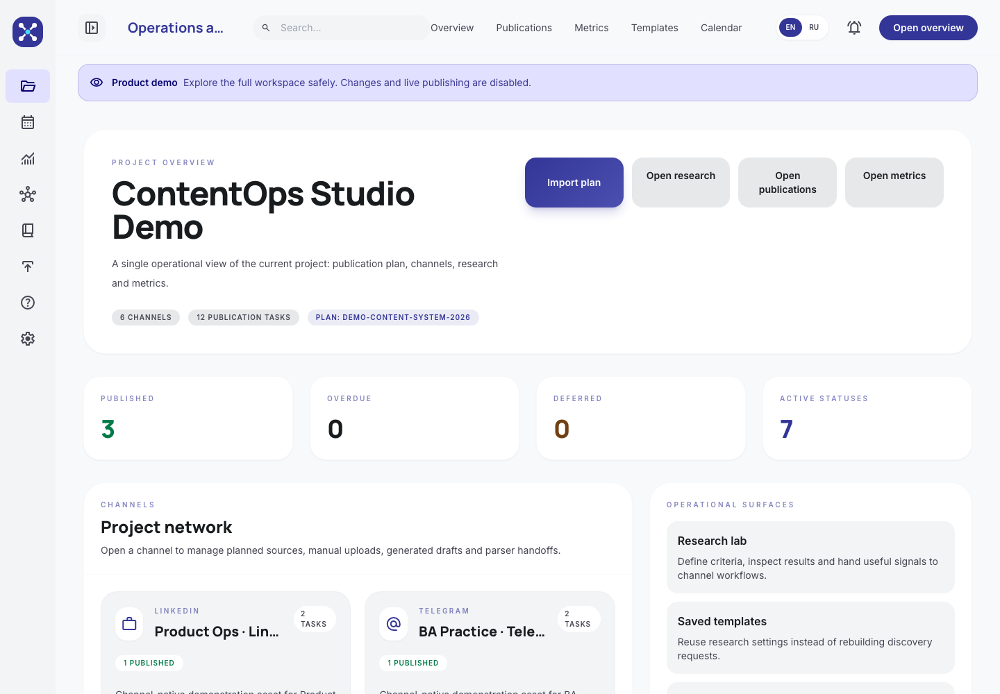
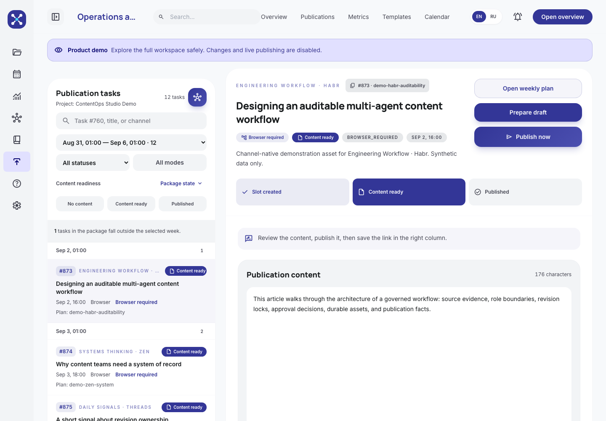
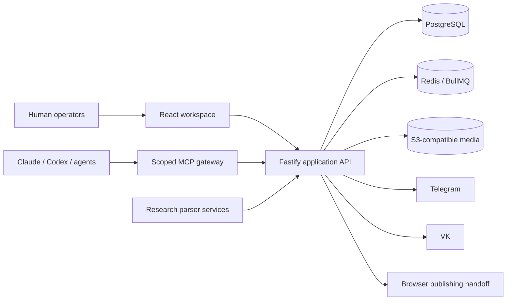

# ContentOps Studio

ContentOps Studio is a governed content operations workspace for teams that need to turn research into an approved cross-channel plan, coordinate human and AI contributors, publish safely, and learn from outcomes.

[Open the product demo](https://publishplanner-production.up.railway.app) | [5-minute walkthrough](docs/PRODUCT_DEMO.md) | [Connect an MCP agent](docs/MCP_SETUP.md) | [Architecture](docs/ARCHITECTURE.md)

> The hosted demo uses synthetic content and a server-enforced read-only account. Credentials are shared separately and are never stored in this repository.



## The problem

Content teams often split research, briefs, drafts, approvals, publishing credentials, and analytics across unrelated tools. The result is difficult to audit: nobody can reliably answer which source informed a claim, which revision was approved, why a task was blocked, or whether a publication changed the next decision.

ContentOps Studio makes that operating chain explicit.



## Product workflow

1. **Research intake** collects signals from Reddit and other sources through a separate parser service.
2. **Operational planning** converts initiatives and constraints into dated weekly packages and channel slots.
3. **Role-scoped production** assigns planning, writing, review, art direction, and publishing work to humans or MCP agents.
4. **Governed approval** binds decisions to exact content and visual revisions.
5. **Safe delivery** uses channel-specific connectors or a controlled browser handoff without exposing credentials to agents.
6. **Outcome analytics** stores publication facts and metric checkpoints for the next planning cycle.

## What is implemented

- Multi-project workspaces with owner, editor, and viewer roles
- Weekly editorial packages, operational calendar, dependencies, and status queues
- Cross-channel publication tasks for Telegram, VK (including personal photo Stories), LinkedIn, Habr, Zen, Threads, and manual destinations
- Exact content-revision acceptance and visual QA gates
- Durable media assets through an S3-compatible storage backend
- Publication facts, checkpoints, and cross-channel analytics
- Project-scoped MCP endpoints for planning, writing, art direction, and owner operations
- Human-readable connector setup inside channel settings
- English and Russian interfaces
- Railway deployment with PostgreSQL, Redis, an application service, MCP gateway, and parser workers

## Architecture



The application and MCP gateway share the same project-scoped domain model. PostgreSQL remains the system of record; agents receive capabilities, not database access. See [docs/ARCHITECTURE.md](docs/ARCHITECTURE.md) for boundaries and deployment details.

## Safety model

- Every project operation is checked against membership and role.
- Remote MCP credentials are bound to a fixed user, project, and capability profile.
- Provider keys, browser sessions, and channel tokens are redacted from API responses.
- Accepted text and approved visual binaries are revision-bound before delivery.
- Shared demo credentials are marked in the database and blocked from every state-changing API request.
- Publication is not considered successful without a provider identity or an explicit manual publication fact.

## Local development

### Requirements

- Node.js 22+
- PostgreSQL 15+
- Redis 7+

### Start the application

```bash
cp .env.example .env
npm ci
npm run migrate:deploy
npm run dev
```

In another terminal:

```bash
npm ci --prefix frontend
npm run dev --prefix frontend
```

The web app runs through Vite in development. Production builds serve the frontend from Fastify.

### Run the MCP gateway

```bash
npm run mcp:remote:dev
```

Configure a project-bound MCP token in the ContentOps Studio settings UI before connecting an external agent. See the [MCP setup guide](docs/MCP_SETUP.md). Do not put production credentials in local configuration files or Git.

### Seed a read-only product demo

The seed is idempotent for the dedicated demo slug and refuses to convert an existing regular account.

```bash
DEMO_USER_EMAIL="demo@example.com" \
DEMO_USER_PASSWORD="use-a-generated-password" \
DEMO_SEED_CONFIRM="CONTENTOPS_STUDIO_PRODUCT_DEMO" \
npm run demo:seed
```

## Verification

```bash
npm run build
npm test
npm run test:ui-contract --prefix frontend
```

## Repository guide

- [`frontend/`](frontend/) - React workspace
- [`src/routes/`](src/routes/) - application and integration APIs
- [`src/services/`](src/services/) - domain workflows and connectors
- [`src/mcp/`](src/mcp/) - scoped MCP server and capability profiles
- [`prisma/`](prisma/) - PostgreSQL schema and migrations
- [`scripts/`](scripts/) - explicit operator and verification tools
- [`docs/`](docs/) - public product and architecture documentation

## Related service

Research collection and scheduled source processing live in the separate [reddit-parser](https://github.com/InnokentyB/reddit-parser) service. ContentOps Studio consumes its project-scoped API rather than embedding scraper runtimes in the web application.

## Status

ContentOps Studio is an actively developed portfolio product running in production. The hosted demo is intended for product and engineering review, not for storing confidential or regulated information.

## License

ISC License. See [LICENSE](LICENSE).
