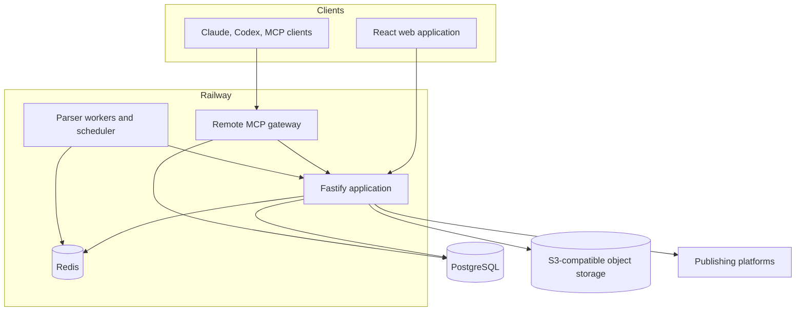

# ContentOps Studio architecture

## System context

ContentOps Studio is a modular monolith with a separate MCP gateway and external research workers. The application API owns workflow invariants; PostgreSQL is the canonical system of record.

## Domain boundaries

### Project and access

Projects isolate members, channels, plans, content, keys, and MCP credentials. Roles are ordered as `viewer`, `editor`, and `owner`. Demo accounts add a server-level read-only restriction across all projects.

### Planning

Quarter plans, month arcs, week packages, initiatives, and dependencies describe what should happen and when. Planning work does not directly overwrite accepted publication copy.

### Production workflow

Content items are the publication-task aggregate. Work items represent role-specific actions such as writing, content review, art direction, visual review, and publishing. Approval decisions are immutable records bound to result versions.

### Content and visual integrity

Accepted text records an exact content revision. Visual decisions bind placement, source content revision, and decision version. Approved assets retain provider, prompt, checksum-oriented provenance, QA, and storage URL.

### Delivery

Adapters resolve the effective channel configuration and either call a verified API connector or produce a browser handoff. A task becomes published only after a provider object identity or explicit manual confirmation is stored as a publication fact.

### Measurement

Publication facts identify the external artifact. Metric snapshots capture scheduled checkpoints such as 24 hours and 72 hours. Analytics queries use these records rather than scraping the operational task list.

### MCP

The remote MCP service exposes capability profiles for planning, writing, art direction, and owner operations. Each token is bound to a project and user. Caller-supplied identity fields are replaced by the credential binding before tools run.

## Deployment

- `planner-app`: web UI, API, connectors, and background coordination
- `planner-mcp`: streamable HTTP MCP gateway
- PostgreSQL: application schema and workflow history
- Redis: queues and scheduler coordination
- S3-compatible storage: durable visual assets
- Parser API, worker, and scheduler: external research collection

Schema changes use versioned Prisma migrations. Production secrets are supplied by Railway variables and are never committed.
