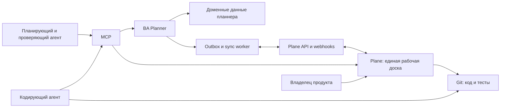

# Решение 002: единый контур задач для планнера и разработки

Статус: proposed  
Дата: 2026-08-10

## Решение

Использовать self-hosted Plane Community Edition как общую рабочую доску для людей и агентов. Не переносить в Plane предметную модель планнера и не делать Plane источником истины для публикаций.

Источники истины разделяются так:

- BA Post Planner владеет инициативами, публикациями, кампаниями, событиями, инфраструктурными работами, зависимостями, `content_due_at`, `publish_at`, согласованиями, каналами, ассетами и метриками.
- Plane владеет представлением исполняемой работы: исполнитель, состояние, приоритет, срок действия, обсуждение и ссылки на результаты.
- Git владеет кодом, тестами, коммитами и историей изменений.

Связь между системами выполняет адаптер трекера. Агенты работают через MCP, но критическая синхронизация использует API, webhooks, outbox и периодическую сверку. MCP не является единственным транспортом.

## Почему не строим собственный трекер

Собственный интерфейс задач потребует отдельно реализовать комментарии, уведомления, поиск, фильтры, права, историю, вложения и рабочие доски. Это не отличает продукт и отвлекает от предметной логики производства контента.

При этом полностью отдать workflow планнера внешнему трекеру тоже нельзя: обычная задача не выражает различие между сроком готовности контента и публикацией, блокировки кампаний, режим канала, ассеты, метрики и правила автопостинга.

## Почему Plane

- self-hosted Community Edition;
- REST API и webhooks;
- официальный MCP server для работы агентов;
- work items, cycles, modules, labels, comments и связи;
- один продукт подходит и редакционной работе, и разработке.

Ограничение: официальный Plane MCP находится в beta. Поэтому агентам удобно работать через MCP, но надежность обеспечивается API-интеграцией и журналом событий планнера.

## Архитектура

### Минимальная модель связи

В планнере у `WorkItem`:

- `tracker_provider = plane`;
- `tracker_project_id`;
- `tracker_item_id`;
- `tracker_url`;
- `sync_version`;
- `last_synced_at`;
- `sync_status` и `sync_error`.

Каждое исходящее изменение сначала фиксируется в транзакционном outbox. Повторная доставка безопасна благодаря idempotency key. Входящие webhook-события проверяются, дедуплицируются и применяются только при разрешенном переходе состояния. Периодическая сверка восстанавливает события, потерянные между системами.

## Отображение состояний

| Планнер | Plane | Смысл |
|---|---|---|
| `available` | Ready | задачу можно брать |
| `claimed` | In Progress | агент владеет действующей арендой |
| `waiting_approval` | In Review | результат ожидает проверки |
| `blocked` | Blocked | продолжение невозможно; указаны причина и следующий шаг |
| `completed` | Done | результат принят |

`overdue` не является состоянием. Это вычисляемый сигнал относительно нужного вида срока. Просроченная задача остается `Ready`, `In Progress`, `In Review` или `Blocked`, поэтому причина задержки не теряется.

## Два рабочих контура

### Производство публикаций

Планнер создает доменную работу, рассчитывает сроки и зависимости, затем публикует проекцию в Plane. Изменение предметных полей выполняется командами BA Planner MCP. Комментарии, назначение и обзор очереди доступны через Plane.

### Разработка

Проверяющий агент создает задачу со ссылками на спецификацию, тесты и критерии приемки. Кодирующий агент берет ее, вносит изменения и прикладывает коммит и результаты проверок. После перевода в `In Review` проверяющий агент получает событие, проводит ревью и либо завершает задачу, либо создает конкретные замечания и возвращает ее в работу. Пользователь подключается к продуктовым решениям и UAT, а не переносит сообщения между агентами.

## Правила взаимодействия агентов

1. Одна задача имеет одного текущего владельца и lease с истечением.
2. Результат передается структурированно: commit, измененные файлы, проверки, известные риски.
3. Замечание ревью содержит приоритет, место, ожидаемое поведение и способ проверки.
4. Агент не закрывает собственную задачу, если для нее требуется независимое согласование.
5. Все команды содержат `project_id`, actor identity и idempotency key.
6. Системный actor использует выданную identity и scopes; произвольные строки actor ID запрещены.

## MVP

### Этап 1. Пилот без глубокой интеграции

- поднять Plane CE отдельно от production-планнера;
- создать проекты `Content Operations` и `Product Development`;
- настроить состояния и обязательные шаблоны задач;
- подключить Plane MCP к Codex и Claude;
- провести одну задачу разработки и одну публикацию от создания до приемки.

### Этап 2. Надежная синхронизация

- добавить `TaskTrackerAdapter` и реализацию Plane;
- добавить outbox, webhook inbox, дедупликацию, retries и reconciliation;
- синхронизировать состояние, исполнителя, action due date, ссылки и комментарии;
- не синхронизировать секреты, внутренние промпты и payload автопостинга.

### Этап 3. Автоматическая передача между агентами

- событие `waiting_approval` запускает проверяющего агента;
- решение `changes_requested` возвращает кодирующего агента;
- таймаут lease и просрочка создают оповещение и следующий action;
- UAT остается явным человеческим gate там, где это указано в спецификации.

## Критерии успеха пилота

- пользователь ни разу не копирует сообщение между агентами вручную;
- из каждой карточки понятно, кто действует следующим и к какому сроку;
- публикационная задача видна в Plane, но ее доменные сроки и зависимости не теряются;
- повтор webhook или команды не создает дубликаты;
- потерянный webhook восстанавливается сверкой;
- недоступность Plane не блокирует сохранение изменения в планнере;
- агент без доступа к проекту не может читать или менять задачу.

## Не входит в первый этап

- собственный UI канбана;
- двустороннее редактирование всех доменных полей;
- автоматическая публикация без approval policy;
- перенос метрик каналов в Plane;
- использование Plane как хранилища контента или изображений.

